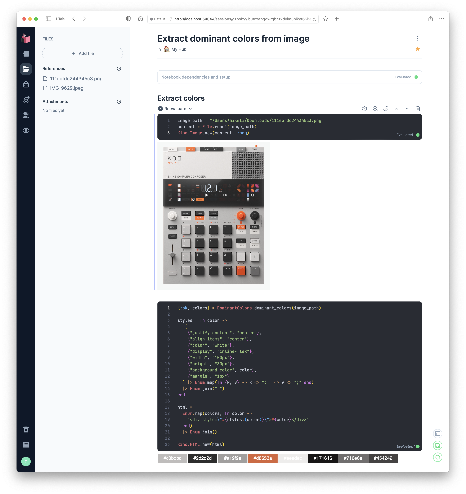

# DominantColors



> Working in progress

Extract dominant colors from given image path. Wrapper around the awesome Rust library [kmeans_colors](https://github.com/okaneco/kmeans-colors).


## Installation

```elixir
def deps do
  [
    {:dominant_colors, "~> 0.1.2"}
  ]
end
```

## Usage

```elixir
file_path = "test-image.png"
colors = DominantColors.dominant_colors(file_path)
# 
```

